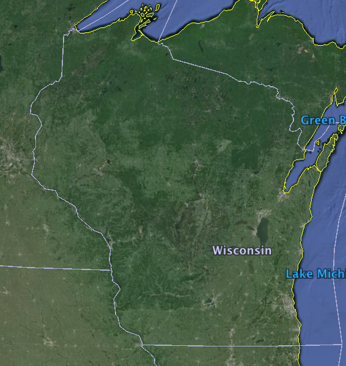

# Example Setup of a New SWB Application {#example_new_application}

[TOC]

This section presents development of a complete SWB 2.0 application for the state of Wisconsin. The tasks involved in setting up a new SWB application are:

1. Determine geographic area of application;
2. Decide on projection system (if any) to be used;
3. Determine which process options within SWB are most appropriate;
4. Locate and possibly download the required climate and GIS datasets;
5. Perform GIS operations, especially if flow routing is to be used;
5. Examine the metadata for each of the climate and GIS datasets, and add directives to the control file as appropriate.
6. Create one or more lookup tables to supply all needed parameters for the process options in use.

# Geographic Area of Application

For this example we're targeting the entire state of Wisconsin, USA. 

# Climate Data

New sources of gridded climate data come online every day. Many of these gridded datasets can be used to provide SWB with the needed precipitation and air temperature data. Making use of these new gridded datasets, however, requires the user to research the ways in which these new data were encoded into the netCDF file format. In this section we document the steps taken in order to generate the control file statements needed to make SWB understand a new data source.

The Global Precipitation Climatology Project (GPCP) generates estimates of precipitation for the entire globe on a daily basis by merging microwave, infrared, and sounder datasets with precipitation gage data. The resolution is 1-degree by 1-degree, far too coarse for many SWB applications, but entirely suitable for this example. The datasets may be found at https://climatedataguide.ucar.edu/climate-data/gpcp-daily-global-precipitation-climatology-project. The remainder of this example assumes that the new netCDF datasets ave been downloaded and placed in a local subdirectory, and that the required software drivers for netCDF files have been downloaded and installed on the user's machine. The netCDF C libraries and utility programs demonstrated in this example may be obtained [here] (http://www.unidata.ucar.edu/software/netcdf/docs/winbin.html).

The first step to take when attempting to use a new data source is to determine the structure, naming conventions, and geographic projection used in packaging the data into the netCDF file format. The program "ncdump" is a utility distributed along with the netCDF C language library. ```ncdump -h``` will comb through the netCDF file and return only header information:

```
ncdump -h GPCP_1DD_v1.2_201306.nc
```
The ```ncdump``` program produces the following output:

```
netcdf GPCP_1DD_v1.2_201306 {
dimensions:
	time = UNLIMITED ; // (30 currently)
	lon = 360 ;
	lat = 180 ;
variables:
	double time(time) ;
		time:long_name = "time" ;
		time:calendar = "standard" ;
		time:units = "days since 1990-01-01 00:00:00" ;
	float lat(lat) ;
		lat:long_name = "latitude" ;
		lat:units = "degrees_north" ;
	float lon(lon) ;
		lon:long_name = "longitude" ;
		lon:units = "degrees_east" ;
	int date(time) ;
		date:long_name = "gregorian date" ;
		date:units = "yyyymmdd" ;
	int yyyyddd(time) ;
		yyyyddd:units = "yyyyddd" ;
		yyyyddd:long_name = "yyyy and day_of_year" ;
	float PREC(time, lat, lon) ;
		PREC:long_name = "GPCP: daily precipitation" ;
		PREC:units = "mm/day" ;
		PREC:_FillValue = -99999.f ;
		PREC:missing_value = -99999.f ;
		PREC:version = "v1.2" ;

// global attributes:
		:title = "GPCP ONE-DEGREE DAILY PRECIPITATION DATA SET" ;
		:GSFC = "http://precip.gsfc.nasa.gov/" ;
		:information = "http://precip.gsfc.nasa.gov/gpcp_daily_comb.html" ;
		:Source = "ftp://rsd.gsfc.nasa.gov/pub/1dd-v1.2/" ;
		:Acknowledgement = "\n",
			"Please cite the original source of the data.\n",
			"Please email the citation to george.j.huffman@nasa.gov or david.t.bolvin@nasa.gov\n",
			"" ;
		:Convention = "CF-1.0" ;
		:comment = "netCDF version of original binary file(s)" ;
		:Conversion = "NCL: http://www.ncl.ucar.edu/" ;
		:ref_1 = "\n",
			"Huffman, G.J., R.F. Adler, M.M. Morrissey, S. Curtis  \n",
			"R. Joyce, B. McGavock, and J. Susskind, 2001:         \n",
			"Global precipitation at one-degree daily resolution from multi-satellite observations\n",
			"J. Hydrometeor., 2, 36-50\n",
			"" ;
		:ref_2 = "\n",
			"Bolvin, David T., Robert F. Adler, George J. Huffman  \n",
			"Eric J. Nelkin, Jani P. Poutiainen, 2009:             \n",
			"Comparison of GPCP Monthly and Daily Precipitation Estimates with High-Latitude Gauge Observations\n",
			"J. Appl. Meteor. Climatol., 48, 1843-1857\n",
			"http://dx.doi.org/10.1175/2009JAMC2147.1\n",
			"" ;
		:ref_3 = "\n",
			"Adler, Robert F., Guojun Gu, George J. Huffman, 2012: \n",
			"Estimating Climatological Bias Errors for the Global Precipitation Climatology Project (GPCP)\n",
			"J. Appl. Meteor. Climatol., 51, 84-99\n",
			"http://dx.doi.org/10.1175/JAMC-D-11-052.1\n",
			"" ;
		:creation_date = "Mon Nov  3 09:01:45 MST 2014" ;
}
```

