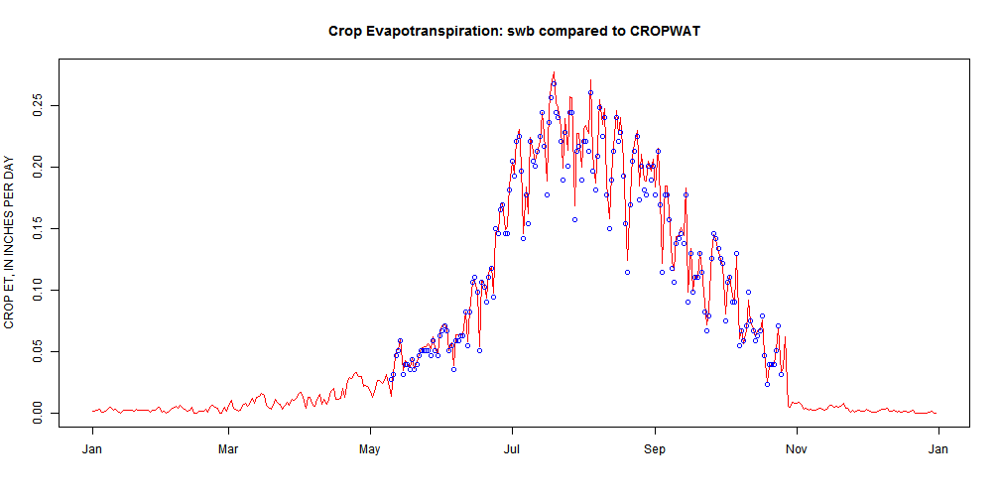

# Soil-Water-Balance Model Irrigation Module: FAO-56 Modes {#irrigation_module_docs}

__________________________________________________________

4. DUAL COEFFICIENT UNDER NONSTANDARD CONDITIONS
-----------------------

The last option for application of the FAO-56 methodology uses the dual-coefficient approach discussed in the last section. Further, this option **disables** the Thornthwaite-Mather soil moisture retention tables and **enables** the reduction of crop evaportanspiration due to water stress. 

 

### References

Allen, R.G., Pereira, L.S., Raes, D. and Smith, M., 1998, Crop evapotranspiration-Guidelines for computing crop water requirements-FAO Irrigation and drainage paper 56: Rome, Food and Agriculture Organization of the United Nations, <http://www.fao.org/docrep/X0490E/x0490e00.htm#Contents>.
