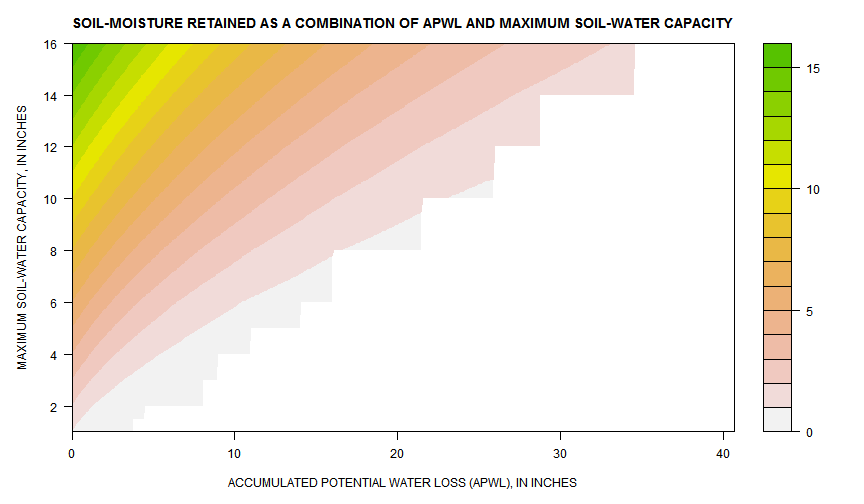
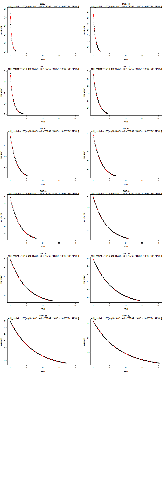

Equation-fitting: Soil-Moisture Retention Tables, Thornthwaite and Mather (1957)
========================================================

This documents the process of fitting general equations to the soil moisture retention tables of Thornthwaite and Mather (1957). The tables are entitled "SOIL MOISTURE RETAINED AFTER DIFFERENT AMOUNTS OF POTENTIAL EVAPOTRANSPIRATION HAVE OCCURRED," and are tablulated for water holding capacities of 1.0 inches through 16.0 inches. This equation fitting exercise is designed as a check of the regression equations coded into the original version of SWB.

The first step is to define the general form of the equation we wish to use to summarize the Thornthwaite-Mather tables. The original version of SWB defines this table with a quartic (4th degree) polynomial:

```r
gen <- function(s1, e, x, y, z) {
    
    pred <- 10^(log10(y) - (s1 * y^e) * x)
    res <- sum((z - pred)^2)
    return(res)
}

gen2 <- function(e, s1, x, y, z) {
    res <- gen(s1, e, x, y, z)
    return(res)
}
```


The next code block reads in the data from Thornthwaite and Mather (1957), Table 2. 


```r
sm <- read.table("Thornthwaite-Mather_Soil_Moisture_ORIGINAL_1957.txt", as.is = T, 
    colClasses = "numeric", header = T)
```


Here is a plot of the soil-moisture retention for various combinations of accumulated potential water loss and maximum soil-water capacity:


```r

par(mar = c(5, 5, 3, 4))

x <- sm$sum_pe
y <- c(1, 1.5, 2, 3, 4, 5, 6, 8, 10, 12, 14, 16)

sm.mat <- as.matrix(sm[, -1])

# filled.contour(x, y, sm.mat, axes=T,xlab='ACCUMULATED POTENTIAL WATER
# LOSS, IN INCHES', ylab='MAXIMUM SOIL-WATER CAPACITY, IN INCHES')
filled.contour(x, y, sm.mat, xlab = "ACCUMULATED POTENTIAL WATER LOSS (APWL), IN INCHES", 
    ylab = "MAXIMUM SOIL-WATER CAPACITY, IN INCHES", col = rev(terrain.colors(20)), 
    main = "SOIL-MOISTURE RETAINED AS A COMBINATION OF APWL AND MAXIMUM SOIL-WATER CAPACITY")
```

 

Now we set up a process to fit exponential functions to the table values so that the table values can be easily calculated on the fly within SWB code.


```r
nr <- dim(sm.mat)[[1]]
nc <- dim(sm.mat)[[2]]

xv <- rep(x, nc)  # APWL values
yv <- rep(y, each = nr)  # SWC values

sm.df <- data.frame(x = xv, y = yv, z = as.vector(sm.mat))

sm.df <- subset(sm.df, !is.na(z))

slope_opt <- optimize(f = gen, c(0.25, 1.35), tol = 1e-08, e = -1.0371, x = sm.df$x, 
    y = sm.df$y, z = sm.df$z)
exponent_opt <- optimize(f = gen2, c(-0.3, -1.4), tol = 1e-08, s1 = slope_opt[[1]], 
    x = sm.df$x, y = sm.df$y, z = sm.df$z)

# compute the soil moisture given the APWL and max soil water capacity
sm.df$pred <- 10^(log10(sm.df$y) - (slope_opt[[1]] * sm.df$y^exponent_opt[[1]]) * 
    sm.df$x)

# now compute the APWL given the current value of soil moisture and the
# max soil water capacity
sm.df$apwl <- (log10(sm.df$y) - log10(sm.df$pred))/(slope_opt[[1]] * sm.df$y^exponent_opt[[1]])
```


Last, we plot up the results and print out the coefficients:


```r

layout(matrix(c(1:16), nrow = 8, ncol = 2, byrow = TRUE))

for (i in 1:length(y)) {
    
    plot(sm[[1]], sm[[i + 1]], main = paste("SWC:", y[i]), xlab = "APWL", ylab = "SOIL MOIST")
    lines(sm.df$x[sm.df$y == y[i]], sm.df$pred[sm.df$y == y[i]], col = "red")
    
    mtext(paste("soil_moist = 10^[log10(SWC) - (", signif(slope_opt[[1]], digits = 6), 
        " * SWC^", signif(exponent_opt[[1]], digits = 6), ") * APWL]", sep = ""))
    
}
```

 

```r

```

